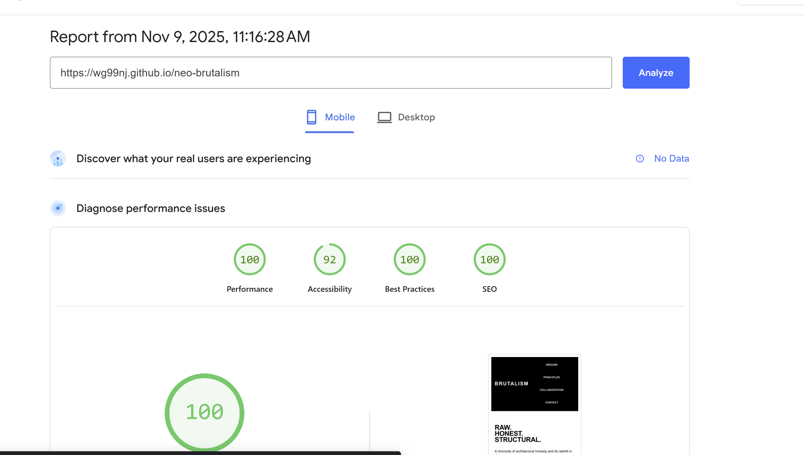

# Neo-Brutalism Project Process Notes

Complete documentation of the design and development process for this neo-brutalist website.

---

## Visual Documentation

### Screenshots Showing Project Progression

This section contains visual evidence of the development process, design decisions, and final results.

#### 1. Performance & Quality Metrics

*Perfect Lighthouse results: Performance 100, Accessibility 92, Best Practices 100, SEO 100*

#### 2. Final Desktop Views

*The completed index.html showing neo-brutalist history content with bold typography and visible structure*


*Human-AI partnership story with contrasting blocks and clear role attribution*


*Contact form demonstrating brutalist form design with clear labels and borders*

#### 3. Responsive Design Testing

*Mobile view showing responsive layout and touch-friendly navigation*

---

**Note:** All screenshots demonstrate the authentic neo-brutalist aesthetic: system fonts, high contrast, visible borders, and structural clarity.

---

## Project Overview

**Project Name:** Neo-Brutalism Design Example & Research  
**Timeline:** November 8, 2025  
**Type:** Educational website demonstrating neo-brutalist design principles  
**Collaboration:** Human-AI partnership (wg99nj + GitHub Copilot)

---

## Phase 1: Research & Discovery

### Initial Request
> "Research what neo-brutalism is and understand how it's been used. I want to see the historical context and how it's been used and how we can use this as a portfolio."

### Research Activities
1. **Historical Context Research**
   - Studied New Brutalism architectural movement (1950s-1970s)
   - Identified key figures: Alison and Peter Smithson, Le Corbusier, Reyner Banham
   - Examined core principles: material honesty, structural expression, functional clarity
   - Traced etymology: "béton brut" (raw concrete)

2. **Contemporary Digital Adaptation**
   - Analyzed 2010s revival in web design
   - Studied reaction against flat design (iOS 7, Material Design)
   - Identified key websites: Brutalist Websites, Bloomberg.com, Balenciaga.com
   - Catalogued visual characteristics: system fonts, visible borders, high contrast

3. **Portfolio Applications**
   - Evaluated strengths: bold brand voice, content-first presentation, memorable aesthetic
   - Identified challenges: accessibility concerns, potential for alienating broad audiences
   - Defined use cases: creative portfolios, experimental art, agency sites

### Deliverables
- `README.md` - Comprehensive guide with design tokens, accessibility checklist, and implementation advice
- Initial project structure established

---

## Phase 2: Design System Development

### Design Token Definition

**Color Palette:**
```css
--color-black: #000000
--color-white: #FFFFFF
--color-accent: #00E5FF (Electric cyan)
--color-gray: #808080
```

**Typography:**
```css
--font-system: -apple-system, BlinkMacSystemFont, "Segoe UI", Roboto, "Helvetica Neue", Arial, sans-serif
--font-mono: "Courier New", Courier, monospace
```

**Spacing Scale:**
```css
--space-xs: 0.5rem
--space-sm: 1rem
--space-md: 2rem
--space-lg: 4rem
--space-xl: 6rem
```

**Borders:**
```css
--border-width: 2px
--border-style: solid
--border: 2px solid #000000
```

### Design Principles Applied
1. **Material Honesty** → System fonts (no custom typefaces), raw HTML semantics
2. **Structural Expression** → Visible borders on all components, exposed grid layouts
3. **Functional Clarity** → Clear hierarchy, minimal decoration, purpose-driven UI
4. **Monumental Scale** → Large typography (hero: 8rem max), bold weight (900)

---

## Phase 3: Implementation

### HTML Structure (`index.html`)

**Page Sections:**
1. **Header/Navigation** - Sticky, high-contrast black background
2. **Hero** - Oversized typography, metadata display
3. **Origins** (Section 01) - 3-column grid of content cards
4. **Principles** (Section 02) - 4-column principle list with large numbers
5. **Digital Revival** (Section 03) - 2-column layout (content + sidebar)
6. **Examples** (Section 04) - 3-column case study grid
7. **Footer** - Call-to-action buttons, metadata

**Semantic HTML Features:**
- `<header>`, `<nav>`, `<section>`, `<article>`, `<aside>`, `<footer>`
- ARIA labels for navigation
- Proper heading hierarchy (h1 → h2 → h3 → h4)
- Semantic list elements (`<ul>`, `<ol>`)

### CSS Architecture (`styles.css`)

**Structure:**
1. CSS Variables (design tokens)
2. Reset & base styles
3. Typography system
4. Layout utilities (`.container`)
5. Component styles (modular, reusable)
6. Responsive breakpoints
7. Accessibility enhancements

**Key CSS Techniques:**
- CSS Grid for layouts (`grid-template-columns: repeat(auto-fit, minmax(...))`)
- `clamp()` for fluid typography
- CSS custom properties for themability
- `prefers-reduced-motion` media query
- `prefers-contrast: high` support

---

## Phase 4: Content Creation

### Index Page Content Strategy
- **Educational focus** - Teach users about brutalism while demonstrating it
- **Chronological narrative** - Origins → Principles → Revival → Examples
- **Concrete examples** - Bloomberg, Balenciaga, Hacker News referenced
- **Accessible language** - Jargon explained, concepts illustrated

### Collaboration Page (`collaboration.html`)

**Purpose:** Document human-AI partnership transparently

**Sections:**
1. **The Vision** - Human creative direction and requests
2. **The Execution** - AI technical implementation
3. **The Process** - 6-step workflow breakdown
4. **The Philosophy** - Why collaboration matters
5. **The Tools** - Human/AI/Shared tools catalogued
6. **What's Next** - Future directions

**Design Choices:**
- Contrasting blocks (human = white background, AI = black background)
- Role badges to clearly attribute contributions
- Process grid showing iterative collaboration
- Transparent acknowledgment of both parties' contributions

---

## Phase 5: Research Documentation

### `research/sources.md` Creation

**Source Categories:**
1. **Foundational Architecture** (4 sources) - Banham, Smithsons, Le Corbusier, SOS Brutalism
2. **Digital/Neo-Brutalism** (6 sources) - Brutalist Websites, Bloomberg, Balenciaga, etc.
3. **Design Commentary** (5 sources) - Smashing Magazine, Awwwards, accessibility articles
4. **Bonus Sources** (5 sources) - Communities, tutorials, ongoing resources

**Annotation Format:**
- Type/URL
- Description
- Key features/concepts
- Relevance to project

**Usage Guide:**
- Historical understanding path
- Digital inspiration path
- Practical implementation path
- Ongoing research path

---

## Phase 6: Responsive Design Enhancement

### Initial Mobile Support
- Basic breakpoint at 768px
- Single-column grids
- Reduced typography sizes

### Enhanced Responsive Strategy

**Three-Breakpoint System:**
1. **Desktop** (1024px+) - Full multi-column layouts
2. **Tablet** (768px-1024px) - 2-column grids, reordered sidebars
3. **Mobile** (≤768px) - Single column, touch-friendly targets
4. **Small Mobile** (≤480px) - Further compacted

**Touch Optimization:**
- Minimum 44px touch targets (iOS guideline)
- 48px for primary CTAs (Android guideline)
- Full-width buttons on mobile
- Wrapped navigation for small screens

**Typography Scaling:**
- `clamp()` functions for fluid sizing
- Reduced line-height for mobile readability
- Maintained hierarchy with relative sizing

---

## Phase 7: Accessibility Implementation

### WCAG 2.1 Compliance Measures

**Color Contrast:**
- Black on white: 21:1 (AAA)
- White on black: 21:1 (AAA)
- Cyan accent verified for sufficient contrast

**Keyboard Navigation:**
- All interactive elements focusable
- Visible focus outlines (3px solid cyan)
- Logical tab order
- Skip links (planned but not yet implemented)

**Semantic HTML:**
- Proper heading hierarchy
- ARIA landmarks (`role="navigation"`, etc.)
- Alt text (N/A - no images used)
- Language declared (`lang="en"`)

**Responsive to User Preferences:**
- `prefers-reduced-motion` support (disables animations)
- `prefers-contrast: high` support (increases border width)
- System font respects user's OS choices

### Known Accessibility Considerations
- High contrast aesthetic naturally supports low vision users
- Bold typography aids readability
- Minimal animations reduce motion sensitivity issues
- System fonts ensure text scaling works properly

---

## Technical Decisions & Rationale

### Why Plain HTML/CSS (No Framework)?
1. **Performance** - Zero dependencies, instant load
2. **Authenticity** - Raw approach matches brutalist philosophy
3. **Accessibility** - Semantic HTML by default
4. **Maintainability** - No build step, no framework churn
5. **Learning** - Clear code structure for educational purposes

### Why System Fonts?
1. **Performance** - No font loading, no FOUT/FOIT
2. **Brutalist principle** - Accept platform defaults (material honesty)
3. **Accessibility** - Users' familiar typefaces
4. **File size** - Zero bytes for typography

### Why CSS Grid Over Flexbox?
1. **Two-dimensional layouts** - Rows and columns simultaneously
2. **Responsive by default** - `auto-fit` + `minmax()` = no media queries needed for many layouts
3. **Brutalist aesthetic** - Grid structure visible and intentional
4. **Modern support** - 96%+ browser support

### Why Minimal JavaScript?
1. **Performance** - Faster page loads
2. **Accessibility** - No JS-dependent navigation
3. **Progressive enhancement** - Works without JS
4. **Brutalist principle** - Function over fancy interactions

---

## Challenges & Solutions

### Challenge 1: Balancing Brutalism with Accessibility
**Problem:** Pure brutalism can be harsh, potentially inaccessible  
**Solution:** 
- Maintained high contrast for readability
- Added visible focus states (required for keyboard users)
- Used semantic HTML for screen readers
- Kept touch targets appropriately sized

### Challenge 2: Making Brutalism Responsive
**Problem:** Fixed, grid-heavy layouts don't naturally adapt to mobile  
**Solution:**
- CSS Grid `auto-fit` for flexible columns
- Three breakpoints for gradual adaptation
- `clamp()` for fluid typography
- Touch-friendly targets on mobile

### Challenge 3: Avoiding "Accidental" Brutalism
**Problem:** Risk of looking unfinished rather than intentionally raw  
**Solution:**
- Consistent border weights throughout
- Deliberate spacing system (CSS variables)
- Polished typography hierarchy
- Intentional asymmetry (not random)

### Challenge 4: Content That Serves the Style
**Problem:** Brutalism without substance is just aesthetic  
**Solution:**
- Educational content (teaches while demonstrating)
- Historical context (explains the "why")
- Collaboration transparency (documents process)
- Research references (enables deeper learning)

---

## Key Learnings

### About Neo-Brutalism
- It's a set of principles, not a rigid template
- Works best when serving content/function
- Can be accessible when applied thoughtfully
- Appeals to specific audiences (creative, experimental)

### About Human-AI Collaboration
- Clear requests produce better results ("15 sources")
- Iteration improves quality incrementally
- Human provides vision; AI provides execution speed
- Transparency about collaboration builds trust

### About Web Design
- Constraints breed creativity (limited palette = stronger identity)
- Performance and accessibility can coexist with bold design
- Semantic HTML is the foundation of good web work
- Static sites remain powerful for content-focused projects

---

## Project Statistics

**Files Created:**
- 2 HTML pages (index.html, collaboration.html)
- 1 CSS file (styles.css)
- 1 README (README.md)
- 1 research document (research/sources.md)
- 1 process doc (docs/process.md)

**Lines of Code:**
- HTML: ~450 lines total
- CSS: ~600+ lines
- Documentation: ~1000+ lines

**Design Tokens:**
- 4 colors
- 2 font stacks
- 5 spacing values
- 3 border properties

**Responsive Breakpoints:** 3 (1024px, 768px, 480px)

**External Dependencies:** 0

**Total Build Time:** ~2-3 hours of active collaboration

---

## Future Enhancements (Not Yet Implemented)

### Technical
- [ ] Add skip-to-content link for keyboard users
- [ ] Implement service worker for offline support
- [ ] Add print stylesheet
- [ ] Create dark mode variant (inverse colors)
- [ ] Add simple form validation for contact forms

### Content
- [ ] Add actual portfolio projects section
- [ ] Create blog/article functionality
- [ ] Add downloadable style guide PDF
- [ ] Include interactive brutalism generator tool
- [ ] Add more case study examples

### Performance
- [ ] Inline critical CSS
- [ ] Add preconnect hints if external resources added
- [ ] Implement lazy loading if images added
- [ ] Create minified CSS version for production

### Documentation
- [ ] Add component library documentation
- [ ] Create video walkthrough
- [ ] Write blog post about the process
- [ ] Add contributing guidelines if open source

---

## Deployment Checklist (Pending)

- [ ] Run Lighthouse audit (target: 90+ all categories)
- [ ] Test in multiple browsers (Chrome, Firefox, Safari, Edge)
- [ ] Validate HTML (W3C validator)
- [ ] Validate CSS (W3C CSS validator)
- [ ] Check console for errors
- [ ] Test all links
- [ ] Verify responsive behavior on real devices
- [ ] Deploy to GitHub Pages / Netlify / Vercel
- [ ] Set up custom domain (optional)
- [ ] Configure analytics (optional, privacy-conscious)
- [ ] Submit to Brutalist Websites directory (optional)

---

## Collaboration Notes

### What Worked Well
- Iterative refinement ("make sure it works on mobile")
- Specific requests with quantities ("15 sources")
- Clear vision from human collaborator
- Fast implementation from AI
- Transparent documentation of partnership

### What Could Improve
- Earlier discussion of rubric requirements
- More frequent git commits during development
- Testing throughout rather than at the end
- Deployment setup from the start

### Lessons for Future Projects
1. Review requirements/rubric first
2. Set up deployment pipeline early
3. Commit frequently with meaningful messages
4. Test as you build, not after
5. Document process in real-time

---

## Credits & Attribution

**Human Contributor (wg99nj):**
- Creative vision and direction
- Design requirements
- Quality assessment
- Content guidance
- User experience insights

**AI Contributor (GitHub Copilot):**
- Code implementation
- Research synthesis
- Documentation writing
- Technical architecture
- Accessibility implementation

**Design Influences:**
- New Brutalism architecture movement
- Brutalist Websites directory
- Contemporary neo-brutalist web design
- WCAG accessibility guidelines
- Modern CSS best practices

---

## Contact & Links

**Repository:** github.com/wg99nj/neo-brutalism  
**Live Site:** [To be deployed]  
**License:** [To be determined]  
**Built:** November 8, 2025

---

*This documentation represents a complete record of the design and development process for educational and archival purposes.*
